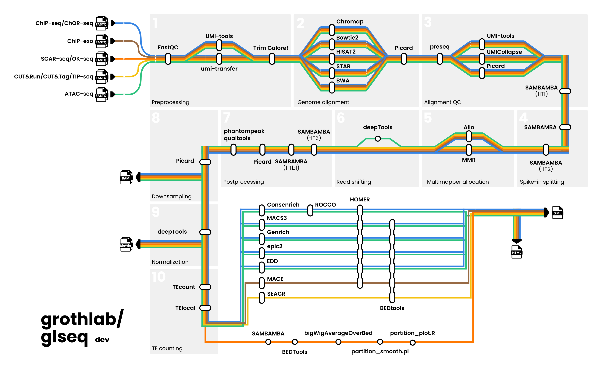

[](https://github.com/grothlab/glseq/actions/workflows/ci.yml)
[](https://github.com/grothlab/glseq/actions/workflows/linting.yml)[](https://doi.org/10.5281/zenodo.XXXXXXX)
[](https://www.nf-test.com)

[](https://www.nextflow.io/)
[](https://docs.conda.io/en/latest/)
[](https://www.docker.com/)
[](https://sylabs.io/docs/)
[](https://cloud.seqera.io/launch?pipeline=https://github.com/grothlab/glseq)

## Introduction

**grothlab/glseq** is a bioinformatics pipeline for comprehensive analysis of bulk chromatin sequencing data. It supports multiple experimental techniques, including [ChIP-seq](https://doi.org/10.1038/nmeth1068), [ChOR-seq](https://doi.org/10.1038/s41596-021-00585-3), [ChIP-exo](https://doi.org/10.1016/j.cell.2011.11.013), [SCAR-seq](https://doi.org/10.1038/s41596-021-00585-3), [OK-seq](https://doi.org/10.1038/ncomms10208), [ATAC-seq](https://doi.org/10.1002/0471142727.mb2129s109), [CUT&RUN](https://doi.org/10.7554/eLife.46314), [CUT&Tag](https://doi.org/10.1038/s41467-019-09982-5) and [TIP-seq](https://doi.org/10.1083/jcb.202103078):

 

<!-- On release, automated continuous integration tests run the pipeline on a [full-sized dataset](https://github.com/nf-core/test-datasets/tree/chipseq#full-test-dataset-origin) on the AWS cloud infrastructure. The dataset consists of FoxA1 (transcription factor) and EZH2 (histone,mark) IP experiments from _Franco et al. 2015_ ([GEO: GSE59530](https://www.ncbi.nlm.nih.gov/geo/query/acc.cgi?acc=GSE59530), [PMID: 25752574](https://pubmed.ncbi.nlm.nih.gov/25752574/)) and _Popovic et al. 2014_ ([GEO: GSE57632](https://www.ncbi.nlm.nih.gov/geo/query/acc.cgi?acc=GSE57632), [PMID: 25188243](https://pubmed.ncbi.nlm.nih.gov/25188243/)), respectively. This ensures that the pipeline runs on AWS, has sensible resource allocation defaults set to run on real-world datasets, and permits the persistent storage of results to benchmark between pipeline releases and other analysis sources. The results obtained from running the full-sized tests can be viewed on the [nf-core website](https://nf-co.re/chipseq/results). -->

The pipeline is built using [Nextflow](https://www.nextflow.io), a workflow tool to run tasks across multiple compute infrastructures in a very portable manner. It uses Docker/Singularity containers making installation trivial and results highly reproducible. The [Nextflow DSL2](https://www.nextflow.io/docs/latest/dsl2.html) implementation of this pipeline uses one container per process which makes it much easier to maintain and update software dependencies. Where possible, these processes have been submitted to and installed from [nf-core/modules](https://github.com/nf-core/modules) in order to make them available to all nf-core pipelines, and to everyone within the Nextflow community!

## Pipeline summary

1. Raw read quality control ([`FastQC`](https://www.bioinformatics.babraham.ac.uk/projects/fastqc/))

2. UMI extraction ([`UMI-tools`](https://github.com/CGATOxford/UMI-tools) or [`umi-transfer`](https://github.com/SciLifeLab/umi-transfer))

3. Adapter, quality or hard trimming ([`Trim Galore!`](https://www.bioinformatics.babraham.ac.uk/projects/trim_galore/))

4. Alignment to reference genome ([`BWA`](https://sourceforge.net/projects/bio-bwa/files/), [`Chromap`](https://github.com/haowenz/chromap), [`Bowtie2`](http://bowtie-bio.sourceforge.net/bowtie2/index.shtml), [`STAR`](https://github.com/alexdobin/STAR), or [`HISAT2`](https://daehwankimlab.github.io/hisat2/))

5. Merging of alignments from multiple libraries of the same sample (technical replicates) ([`picard`](https://broadinstitute.github.io/picard/))

6. Estimation of library complexity ([`Preseq`](http://smithlabresearch.org/software/preseq/))

7. UMI-based deduplication ([`UMI-tools`](https://github.com/CGATOxford/UMI-tools) or [`UMICollapse`](https://github.com/Daniel-Liu-c0deb0t/UMICollapse)) or marking of duplicates ([`picard`](https://broadinstitute.github.io/picard/))

8. BAM filtering to remove ([`SAMBAMBA`](https://lomereiter.github.io/sambamba/))
    - unmapped or improperly paired reads
    - reads marked as duplicates

9. BAM splitting by genome (into endogenous and exogenous/spike-in alignments) ([`SAMBAMBA`](https://lomereiter.github.io/sambamba/))

10. Multimapping read allocation ([`Chromap`](https://github.com/haowenz/chromap), [`MMR`](https://github.com/ratschlab/mmr) or [`Allo`](https://github.com/seqcode/allo))


11. Shifting of aligned reads (only for ATAC-seq) ([`deepTools`](https://deeptools.readthedocs.io/en/latest/content/tools/alignmentSieve.html#alignmentsieve))

12. BAM filtering to remove ([`SAMBAMBA`](https://lomereiter.github.io/sambamba/)):
    - unmapped or improperly paired reads
    - reads with low mapping quality (depending on the aligner used)
    - secondary alignments

13. BAM filtering to remove:
    - reads mapped within blacklisted regions ([`SAMBAMBA`](https://lomereiter.github.io/sambamba/))
    - orphan reads (singletons) ([`bampe_rm_orphan.py`](./bin/bampe_rm_orphan.py))

14. Collection of alignment quality control metrics ([`picard`](https://broadinstitute.github.io/picard/))

15. Calculation of strand cross-correlation, peak and ChIP-seq quality measures including NSC and RSC ([`phantompeakqualtools`](https://github.com/kundajelab/phantompeakqualtools))

16. BAM downsampling considering sample type (IP or input control) and genome (endogenous or spike-in) ([`picard`](https://gatk.broadinstitute.org/hc/en-us/articles/360037056792-DownsampleSam-Picard))

17. Creation of coverage tracks (with a specified bin size) and applying multiple [normalization methods](./docs/output.md#normalized-bigwig-files) accounting for spike-in ([`deepTools`](https://deeptools.readthedocs.io/en/develop/content/tools/bamCoverage.html))

18. Generating gene-body meta-profile from coverage files ([`deepTools`](https://deeptools.readthedocs.io/en/develop/content/tools/plotProfile.html))

19. Counting of reads mapping on transposable elements instances ([`TElocal`](https://github.com/mhammell-laboratory/TElocal)) and subfamilies ([`TEcount`](https://github.com/mhammell-laboratory/TEtranscripts?tab=readme-ov-file#tecount))

20. Calculating genome-wide IP enrichment relative to input control ([`deepTools`](https://deeptools.readthedocs.io/en/develop/content/tools/plotFingerprint.html))

<details>
<summary><b>21. ChIP-seq, ChOR-seq and ATAC-seq downstream analyses</b></summary>

  - Call megabase domains of enrichment ([`EDD`](https://github.com/CollasLab/edd)), annotate ([`HOMER`](http://homer.ucsd.edu/homer/download.html)), and create consensus peakset ([`BEDTools`](https://github.com/arq5x/bedtools2/))

  - Call broad/narrow peaks ([`MACS3`](https://github.com/macs3-project/MACS)), annotate ([`HOMER`](http://homer.ucsd.edu/homer/download.html)), and create consensus peakset ([`BEDTools`](https://github.com/arq5x/bedtools2/))
  
  - Call peaks ([`Genrich`](https://github.com/jsh58/Genrich)), annotate ([`HOMER`](http://homer.ucsd.edu/homer/download.html)), and create consensus peakset ([`BEDTools`](https://github.com/arq5x/bedtools2/))

  - Call diffuse peaks ([`epic2`](https://github.com/biocore-ntnu/epic2)), annotate ([`HOMER`](http://homer.ucsd.edu/homer/download.html)), and create consensus peakset ([`BEDTools`](https://github.com/arq5x/bedtools2/))

  - Extract genome-wide uncertainty-moderated signal from multi-sample datasets ([`Consenrich`](https://github.com/nolan-h-hamilton/Consenrich)), call consensus peaks ([`ROCCO`](https://github.com/nolan-h-hamilton/ROCCO)) and annotate ([`HOMER`](http://homer.ucsd.edu/homer/download.html))

  - Count reads in consensus peaks ([`featureCounts`](http://bioinf.wehi.edu.au/featureCounts/))

  - PCA and clustering ([`R`](https://www.r-project.org/), [`DESeq2`](https://bioconductor.org/packages/release/bioc/html/DESeq2.html))
</details>

<br>

<details>
<summary><b>22. SCAR-seq and OK-seq downstream analyses</b></summary>

  - Splitting BAM files by forward and reverse strands.

  - Computing BEDGRAPH summaries of feature coverage per strand ([`BEDTools`](https://bedtools.readthedocs.io/en/latest/content/tools/genomecov.html))

  - Creating BigWig files from BEDGRAPH files ([`bedGraphToBigWig`](http://hgdownload.soe.ucsc.edu/admin/exe/))

  - Computing the average coverage per window ([`bigWigAverageOverBed`](http://hgdownload.soe.ucsc.edu/admin/exe/))

  - Calculating partition score or replication fork directionality (RFD) ([`partition_or_rfd_smooth.pl`](./bin/partition_or_rfd_smooth.pl))

  - Generating partition files for samples, stranded inputs and input-corrected samples.

  - Plotting partition files and scatter-correlation plots against OK-seq if provided ([`partition_or_rfd_plot.R`](./bin/partition_or_rfd_plot.R))

</details>

<br>

<details>
<summary><b>23. ChIP-exo downstream analyses</b></summary>

  - Call peaks ([`MACE`](https://chipexo.sourceforge.net/)), annotate ([`HOMER`](http://homer.ucsd.edu/homer/download.html)), and create consensus peakset ([`BEDTools`](https://github.com/arq5x/bedtools2/))

</details>

<br>

<details>

<summary><b>24. CUT&RUN, CUT&Tag and TIP-seq downstream analyses</b></summary>

  - Call peaks ([`SEACR`](https://github.com/FredHutch/SEACR)), annotate ([`HOMER`](http://homer.ucsd.edu/homer/download.html)), and create consensus peakset ([`BEDTools`](https://github.com/arq5x/bedtools2/))

</details>

<br>

25. Create IGV session file containing coverage tracks and peaks for data visualisation ([`IGV`](https://software.broadinstitute.org/software/igv/)).

26. Present QC and stats for raw reads, alignments and peak-calling ([`MultiQC`](http://multiqc.info/), [`R`](https://www.r-project.org/))

## Quick start

1. Install [`Nextflow`](https://www.nextflow.io/docs/latest/getstarted.html#installation) (`>=24.10.0`)

2. Install any of [`Docker`](https://docs.docker.com/engine/installation/), [`Singularity`](https://www.sylabs.io/guides/3.0/user-guide/) (you can follow [this tutorial](https://singularity-tutorial.github.io/01-installation/)), [`Podman`](https://podman.io/), [`Shifter`](https://nersc.gitlab.io/development/shifter/how-to-use/) or [`Charliecloud`](https://hpc.github.io/charliecloud/) for full pipeline reproducibility _(you can use [`Conda`](https://conda.io/miniconda.html) both to install Nextflow itself and also to manage software within pipelines. Please only use it within pipelines as a last resort; see [docs](https://nf-co.re/usage/configuration#basic-configuration-profiles))_.

3. Download the pipeline and test it on a minimal dataset with a single command:

    ```bash
    nextflow run grothlab/glseq \
      -profile test,<your_profile> \
      --outdir <path_to_output_directory>
    ```

    Note that some form of configuration will be needed so that Nextflow knows how to fetch the required software. This is usually done in the form of a config profile (`<your_profile>` in the example command above). You can chain multiple config profiles in a comma-separated string.

    > - The pipeline comes with config profiles called `docker`, `singularity`, `podman`, `shifter`, `charliecloud` and `conda` which instruct the pipeline to use the named tool for software management. For example, `-profile test,docker`.
    > - Please check [nf-core/configs](https://github.com/nf-core/configs#documentation) to see if a custom config file to run nf-core pipelines already exists for your Institute. If so, you can simply use `-profile <institute>` in your command. This will enable either `docker` or `singularity` and set the appropriate execution settings for your local compute environment.
    > - If you are using `singularity`, please use the [`nf-core download`](https://nf-co.re/tools/#downloading-pipelines-for-offline-use) command to download images first, before running the pipeline. Setting the [`NXF_SINGULARITY_CACHEDIR` or `singularity.cacheDir`](https://www.nextflow.io/docs/latest/singularity.html?#singularity-docker-hub) Nextflow options enables you to store and re-use the images from a central location for future pipeline runs.
    > - If you are using `conda`, it is highly recommended to use the [`NXF_CONDA_CACHEDIR` or `conda.cacheDir`](https://www.nextflow.io/docs/latest/conda.html) settings to store the environments in a central location for future pipeline runs.

4. Start running your own analysis!

    ```bash
    nextflow run grothlab/glseq \
      --input <path_to_your_input_samplesheet_csv_file> \
      --outdir <path_to_output_directory> \
      --genome GRCh37 \
      --fasta <path_to_your_genome_fasta_file> \
      -profile <docker/singularity/podman/shifter/charliecloud/conda/institute>
    ```

## Usage

> [!IMPORTANT]
> See the [usage docs](./docs/usage.md) for an overview of how the pipeline works, how to run it and a description of all of the different command-line flags and parameters.

> [!NOTE]
> See the [usage guide for DAN System users](./docs/ku_sund_danhead_glseq_usage.md) for special instructions on how to run the pipeline on the DAN System.

## Output

> [!IMPORTANT]
> See the [output docs](./docs/output.md) for an overview of the different results produced by the pipeline and how to interpret them.

## Credits

The [glseq](https://github.com/grothlab/glseq) pipeline was written by Samuel Ruiz-Pérez ([@samuelruizperez](https://github.com/samuelruizperez)) at the Groth Lab ([@grothlab](https://github.com/grothlab)).

Several scripts in this pipeline are based on [nf-core/chipseq](https://github.com/nf-core/chipseq) scripts. For more information regarding nf-core/chipseq, see [https://github.com/nf-core/chipseq?tab=readme-ov-file#credits](https://github.com/nf-core/chipseq?tab=readme-ov-file#credits)

## Contributions and Support

If you would like to contribute to this pipeline, please see the [contributing guidelines](.github/CONTRIBUTING.md).

<!-- TODO: -->
For further information or help, don't hesitate to get in touch through the pipeline's [GitHub Discussions](https://github.com/grothlab/glseq/discussions) or directly with Samuel Ruiz-Pérez ([samper@cancer.dk](mailto:samper@cancer.dk))

## Citations

If you use [grothlab/glseq](https://github.com/grothlab/glseq) for your analysis, please cite it as below:

> Ruiz-Pérez, S., Alcaraz, N., & Groth, A. (2025). grothlab/glseq: A bioinformatics pipeline for the analysis of chromatin sequencing data (Version dev) [Computer software]. https://github.com/grothlab/glseq

This pipeline uses code developed and maintained by the [nf-core](https://nf-co.re) initative, and reused here under the [MIT license](https://github.com/nf-core/tools/blob/master/LICENSE).

> **The nf-core framework for community-curated bioinformatics pipelines.**
>
> Philip Ewels, Alexander Peltzer, Sven Fillinger, Harshil Patel, Johannes Alneberg, Andreas Wilm, Maxime Ulysse Garcia, Paolo Di Tommaso & Sven Nahnsen.
>
> _Nat Biotechnol._ 2020 Feb 13. doi: [10.1038/s41587-020-0439-x](https://dx.doi.org/10.1038/s41587-020-0439-x).

In addition, an extensive list of references for the tools used by the pipeline can be found in the [`CITATIONS.md`](CITATIONS.md) file.
